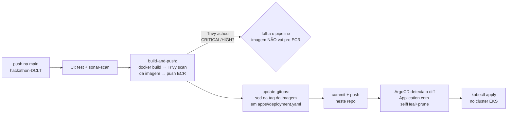

# solidarytech-gitops

Repositório GitOps do SolidaryTech — contém todos os manifests Kubernetes
gerenciados pelo ArgoCD para os 3 microsserviços (`ngo-service`,
`donation-service`, `volunteer-service`). Estrutura espelhada do
[togglemaster-gitops](https://github.com/vitorrgabriell/togglemaster-gitops).

O código-fonte, Dockerfiles, Terraform e pipelines de CI vivem no repo
[hackathon-DCLT](https://github.com/vitorrgabriell/hackathon-DCLT) — este
repo aqui é só o estado desejado do cluster.

## Fluxo: pipeline → GitOps → ArgoCD



Passo a passo:

1. Alguém dá push em `ngo-service/`, `donation-service/` ou
   `volunteer-service/` no repo `hackathon-DCLT`, na branch `main`.
2. O workflow correspondente (`ci-ngo.yml`, `ci-donation.yml` ou
   `ci-volunteer.yml`) chama `ci-reusable.yml`, que roda testes e o scan
   Sonar em paralelo.
3. Se os dois passarem, o job `build-and-push` builda a imagem, roda o
   **Trivy na imagem** (`severity: CRITICAL,HIGH`, `exit-code: 1`) e só
   publica no ECR se o scan passar.
4. O job `update-gitops` faz checkout **deste repo**, troca a tag da
   imagem em `apps/<service>/deployment.yaml` via `sed` e dá push direto na
   `main` deste repo.
5. O ArgoCD (instalado no próprio cluster EKS) tem um `Application` por
   serviço com `syncPolicy.automated` (`prune: true`, `selfHeal: true`) —
   ele detecta o commit novo neste repo e aplica o `deployment.yaml`
   atualizado no cluster sozinho, sem intervenção manual. `selfHeal: true`
   também significa que qualquer `kubectl edit`/`delete` manual no cluster
   é revertido automaticamente pro que está commitado aqui — **este repo é
   a única fonte de verdade do estado do cluster**.

## Estrutura

```
solidarytech-gitops/
├── argocd/
│   ├── applications.yaml   # ArgoCD Applications (uma por serviço + base)
│   └── install.sh          # Instala o ArgoCD do zero num cluster novo
│
├── base/
│   ├── namespace.yaml      # Namespace solidarytech (único arquivo sincronizado
│   │                       # pelo Application "solidarytech-base" — o path
│   │                       # "base" não é lido recursivamente, então
│   │                       # base/secrets/ fica fora do sync do ArgoCD)
│   └── secrets/
│       ├── .env.example
│       ├── apply-secrets.sh
│       └── README.md
│
├── apps/
│   ├── ngo-service/
│   │   ├── deployment.yaml
│   │   ├── service.yaml
│   │   └── hpa.yaml
│   ├── donation-service/      (mesmos 3 arquivos)
│   └── volunteer-service/
│       ├── deployment.yaml           # web (HTTP), gunicorn
│       ├── deployment-consumer.yaml  # worker: mesma imagem, consome SQS
│       ├── service.yaml
│       └── hpa.yaml
│
├── monitoring/              # OTel Collector, kube-prometheus-stack, loki-stack,
│                            # dashboards — ver monitoring/README.md (instalação
│                            # é um passo manual separado, não entra no bootstrap.sh)
│
└── bootstrap.sh             # instala ArgoCD + secrets + applications, tudo de uma vez
```

## Por que sem overlays por ambiente

Considerei Kustomize `base/` + `overlays/{dev,staging,production}/`, mas
hoje só existe **um** ambiente de verdade (o Terraform em
`hackathon-DCLT/infra` só provisiona `production`, um único cluster EKS,
sem infra paralela de dev/staging). Adicionar overlays agora seria
indireção sem benefício imediato — o próprio `togglemaster-gitops`, que é
mais maduro que este projeto (tem monitoring, alerting, mais serviços),
também não usa overlays, pelo mesmo motivo.

Quando um segundo ambiente existir de verdade, a migração é direta:
`base/` vira a fonte comum e cada ambiente ganha um
`overlays/<env>/kustomization.yaml` com patches (replicas, tag de imagem,
requests/limits). Não vale a pena montar isso hoje para um ambiente que
não existe.

## Serviços

| Serviço | Porta | Secret | HPA |
|---|---|---|---|
| ngo-service | 8081 | `ngo-service-secret` (`DATABASE_URL`) | min 2 / max 4, 70% CPU |
| donation-service | 8082 | `donation-service-secret` (`DATABASE_URL`, `AWS_SQS_URL`) | min 2 / max 6, 60% CPU (hot path) |
| volunteer-service | 8083 | — (ver nota de segurança abaixo) | min 2 / max 4, 70% CPU |
| volunteer-consumer | — (sem HTTP, worker) | usa `AWS_SQS_URL` do secret do donation-service | sem HPA (1 réplica fixa) |

`volunteer-consumer` é a mesma imagem do `volunteer-service` rodando com
`command` diferente (consome a fila SQS em vez de servir HTTP) — é o hop
assíncrono que fecha o trace de ponta a ponta entre os 3 serviços, ver
[`monitoring/README.md`](monitoring/README.md).

## Observabilidade

Tracing distribuído, métricas e logs dos 3 serviços — OTel Collector como
hub central, kube-prometheus-stack, loki-stack e Datadog como APM. Não
entra no `bootstrap.sh` (mesma decisão do `togglemaster-gitops`): é um
passo manual separado, documentado em
[`monitoring/README.md`](monitoring/README.md) (inclui a conta de
capacidade do cluster "leaner lab" e como uma requisição de doação aparece
atravessando os 3 serviços num trace só).

## Primeiro deploy

### 1. Bootstrap completo (ArgoCD + secrets + Applications)

```bash
cd base/secrets
cp .env.example .env
# preencha o .env com os valores reais (terraform output, no repo hackathon-DCLT/infra)
cd ../..
bash bootstrap.sh
```

Ou passo a passo, se preferir mais controle:

```bash
bash argocd/install.sh          # só instala o ArgoCD + aplica as Applications
bash base/secrets/apply-secrets.sh   # aplica os secrets separadamente
```

### 2. Preencher o `<AWS_ACCOUNT_ID>` nas imagens

Os 3 `deployment.yaml` em `apps/` têm `<AWS_ACCOUNT_ID>` como placeholder no
campo `image:`. Isso só precisa ser preenchido **uma vez**, manualmente, no
primeiro deploy — o pipeline (`update-gitops`) só troca a tag depois disso,
nunca o account ID:

```bash
ACCOUNT_ID=$(cd ../hackathon-DCLT/infra && terraform output -raw aws_account_id)
# o glob "deployment*.yaml" pega tanto deployment.yaml quanto
# deployment-consumer.yaml (volunteer-service, mesma imagem)
sed -i "s/<AWS_ACCOUNT_ID>/${ACCOUNT_ID}/" apps/*/deployment*.yaml
git add apps/*/deployment*.yaml
git commit -m "chore: set AWS account id nas imagens ECR"
git push
```

### 3. Acessar o ArgoCD

```bash
kubectl port-forward svc/argocd-server -n argocd 8080:443
# senha:
kubectl -n argocd get secret argocd-initial-admin-secret -o jsonpath='{.data.password}' | base64 -d
```

```
URL:     https://localhost:8080
Usuário: admin
```

## Nota de segurança: por que não há credencial AWS em Secret nenhum

Diferente do `togglemaster-gitops` (que guarda `AWS_ACCESS_KEY_ID` /
`AWS_SECRET_ACCESS_KEY` / `AWS_SESSION_TOKEN` no Secret `aws-secret`), os
manifests deste repo **não** carregam nenhuma credencial AWS estática. No
AWS Academy Learner Lab não é possível criar uma IAM role dedicada por
Service Account (IRSA), então `donation-service` (SQS) e
`volunteer-service` (DynamoDB) herdam as permissões da `LabRole` anexada ao
node do EKS via IMDS — o SDK resolve as credenciais sozinho, sem nenhuma
env var de credencial no pod. Isso é uma concessão ao Academy, não best
practice (qualquer pod no node tem as mesmas permissões amplas da
LabRole, não só quem precisa delas) — ver a nota completa em
[`hackathon-DCLT/k8s/README.md`](https://github.com/vitorrgabriell/hackathon-DCLT/blob/main/k8s/README.md).
Fora do Academy, troque isso por IRSA com uma role por serviço.

## Atualizando imagens manualmente (sem esperar o pipeline)

```bash
IMAGE_TAG="sha-abc1234"
sed -i "s|\(image:.*solidarytech/ngo-service:\)[^ ]*|\1${IMAGE_TAG}|" apps/ngo-service/deployment.yaml
git add apps/ngo-service/deployment.yaml
git commit -m "chore: update ngo-service image to ${IMAGE_TAG}"
git push
```

Pra `volunteer-service`, lembre de trocar a tag nos **dois** arquivos (web
+ consumer, mesma imagem) — use o glob `deployment*.yaml` em vez do arquivo
único, igual o CI já faz:

```bash
sed -i "s|\(image:.*solidarytech/volunteer-service:\)[^ ]*|\1${IMAGE_TAG}|" apps/volunteer-service/deployment*.yaml
git add apps/volunteer-service/deployment*.yaml
```

O ArgoCD sincroniza sozinho em até 3 minutos (intervalo padrão de polling),
ou instantaneamente se você clicar em "Sync" na UI.
